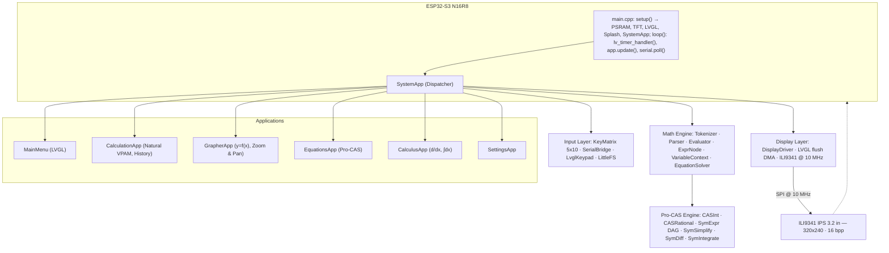
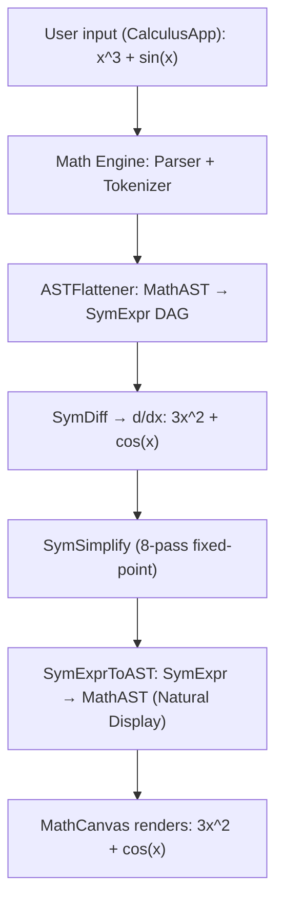
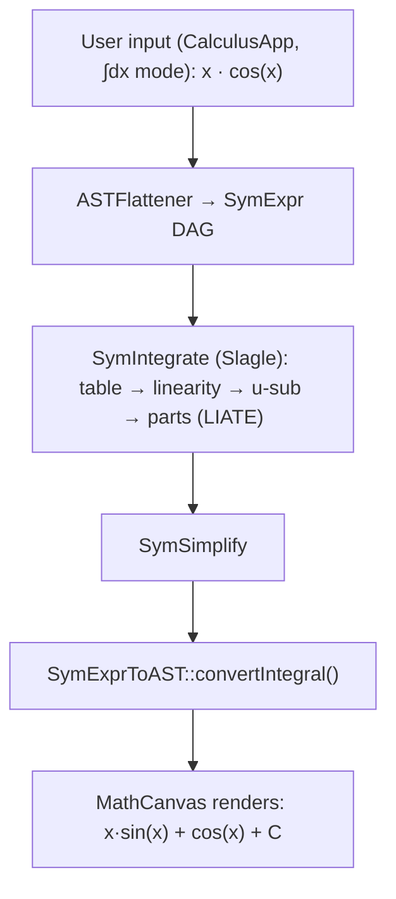

<div align="center">

<br>

# 🔢 NumOS

### Open-Source Scientific Graphing Calculator OS

**ESP32-S3 N16R8 · ILI9341 IPS 320×240 · LVGL 9.x · Pro-CAS Engine · Natural Display V.P.A.M.**

<br>

[](https://platformio.org/)
[](https://lvgl.io/)
[](https://www.espressif.com/en/products/socs/esp32-s3)
[](https://neocalculator.tech)
[](https://www.arduino.cc/)
[](https://en.cppreference.com/)
[](LICENSE)
[](#project-status)
[](#build-stats)
[](#build-stats)

<br>

> *A real open-source alternative to commercial scientific calculators.*
> *Inspired by NumWorks · TI-84 Plus · HP Prime G2, built from scratch in C++17.*

<br>

</div>

<sub>*This project was developed with AI assistance (Claude/Copilot) for code generation, guided by the author's systems architecture decisions. All design choices like DAG structure, memory management, parser design, were made and validated by the author.*</sub>

---


## Table of Contents

0. [Webpage](https://neocalculator.tech/)
1. [What is NumOS?](#what-is-numos)
2. [Key Features](#key-features)
3. [System Architecture](#system-architecture)
4. [Pro-CAS Engine](#pro-cas-engine)
5. [Hardware](#hardware)
6. [Quick Start](#quick-start)
7. [User Manual — EquationsApp](#user-manual--equationsapp)
8. [Project Structure](#project-structure)
9. [Build Stats](#build-stats)
10. [Critical Hardware Fixes](#critical-hardware-fixes)
11. [Project Status](#project-status)
12. [Technology Stack](#technology-stack)
13. [Comparison with Commercial Calculators](#comparison-with-commercial-calculators)
14. [Documentation](#documentation)
15. [Contributing](#contributing)

---

## What is NumOS?

**NumOS** is an open-source scientific and graphing calculator operating system built on the **ESP32-S3 N16R8** microcontroller (16 MB Flash QIO + 8 MB PSRAM OPI). The project aims to become the best open-source calculator in the world, rivalling the Casio fx-991EX ClassWiz, the NumWorks, the TI-84 Plus CE, and the HP Prime G2.

**NumOS delivers:**

- **Full Pro-CAS Engine** — Advanced symbolic algebra: immutable DAG with hash-consing (`ConsTable`), overflow-safe bignum arithmetic (`CASInt`/`CASRational`), multi-pass fixed-point simplifier, symbolic differentiation (17 rules), symbolic integration (Slagle heuristic), and non-linear equation/system solving via Sylvester resultant. All memory managed in PSRAM with an STL-compatible allocator.
- **Natural Display V.P.A.M.** — Formulae rendered as they appear on paper: real stacked fractions, radical symbols (√), genuine superscripts, 2D navigation with a structural smart cursor.
- **Modern LVGL 9.x Interface** — Smooth transitions, animated splash screen, NumWorks-style launcher with icons and a 3×N grid, apps with multiple states and clean lifecycle management.
 - **Modern LVGL 9.x Interface** — Smooth transitions, animated splash screen, NumWorks-style launcher.
    Recent launcher refactor: the launcher now uses LVGL Flex `ROW_WRAP` (dynamic rows) with fixed card sizing
    instead of a static grid descriptor. See `docs/UI_CHANGES.md` for developer migration notes and
    `docs/fluid2d_plan.md` for an example app (Fluid2D) integrated into the new APPS[] schema.
- **Custom Math Engine** — Complete pipeline: Tokenizer → Shunting-Yard Parser → RPN Evaluator + Visual AST, implemented from scratch in C++17.
- **Modular App Architecture** — Each application is a self-contained module with explicit lifecycle (`begin/end/load/handleKey`), orchestrated by `SystemApp`.

---

## Key Features

| Feature | Description |
|:--------|:------------|
| **CAS-S3-ULTRA Engine** | Sylvester Resultant solver (3×3 NL systems), 16-seed Newton-Raphson, BigInt precision (`CASInt` + `CASRational`), hash-consed DAG, 8-pass fixed-point simplifier, PSRAM-backed step logger |
| **Unified Calculus App** | Symbolic $d/dx$ differentiation (17 rules) and numerical/symbolic $\int dx$ integration (Slagle heuristic: table lookup, linearity, u-substitution, integration by parts/LIATE), tab-based mode switching, automatic simplification, and detailed step-by-step output |
| **EquationsApp** | Solves linear, quadratic, and 2×2 systems (linear + non-linear via Sylvester resultant) with full step-by-step display |
| **Bridge Designer** | Real-time structural bridge simulator with Verlet integration physics, stress analysis (green→red beam visualisation), snap-to-grid editor, wood/steel/cable materials, and truck/car load testing — PSRAM-backed, 60 Hz fixed timestep |
| **Particle Lab** | Powder-Toy-class sandbox: 30+ materials (Sand, Water, Lava, LN2, Wire, Iron, Titan, C4, Clone), spark electronics with Joule heating, phase transitions, reaction matrix (Water+Lava=Stone+Steam), Bresenham line tool, material palette overlay, LittleFS save/load |
| **Settings App** | System-wide toggles for complex number output (ON/OFF), decimal precision selector (6/8/10/12 digits), and angle-mode display |
| **Natural Display** | Real fractions, radicals, exponents, 2D cursors — mathematical rendering as it appears on paper |
| **Graphing: y=f(x)** | Real-time function plotter with zoom, pan, and value table |
| **85+ CAS Unit Tests** | Comprehensive test suite for the Pro-CAS, enable/disable via compile-time flag |
| **PSRAMAllocator** | CAS uses `PSRAMAllocator<T>` to isolate memory usage in the 8 MB PSRAM OPI |
| **Variables A–Z + Ans** | Persistent storage via LittleFS — 216 bytes in `/vars.dat` |
| **SerialBridge** | Full calculator control from PC via Serial Monitor without physical hardware |
| **SerialBridge Debug** | Immediate byte echo, 5-second heartbeat, 8-event circular buffer |

---

## Photo gallery

### Neural Network Simulator:


### Fluid 2D Simulator:


### Periodic Table (Chemistry App):


### Grapher App:


### Steps (Equations App) (WIP, still in development, Alpha):


### Calculus App:


### Probability (Gaussian Distribution):


### Python App:


### Bridge Designer:


### Circuit Simulator (Circuit Core, Alpha):


### Particle Lab (Powder Toy like):


### Optics Lab:


---

## System Architecture



---

## Pro-CAS Engine

The **Pro-CAS** (Computer Algebra System) is NumOS's complete symbolic-algebra engine. Evolved from the original CAS-Lite, it implements an immutable DAG with hash-consing, overflow-safe bignum arithmetic, multi-pass fixed-point simplification, symbolic differentiation, symbolic integration (Slagle), and non-linear system solving via Sylvester resultant. All CAS memory resides in PSRAM.

### CAS Pipeline (Derivatives)



### CAS Pipeline (Integrals)



### Pro-CAS Components

| Module | File | Responsibility |
|:-------|:-----|:---------------|
| `CASInt` | `cas/CASInt.h` | Hybrid BigInt: `int64_t` fast-path + `mbedtls_mpi` on overflow |
| `CASRational` | `cas/CASRational.h/.cpp` | Overflow-safe exact fraction (num/den with auto-GCD) |
| `PSRAMAllocator<T>` | `cas/PSRAMAllocator.h` | STL allocator → `ps_malloc`/`ps_free` for PSRAM |
| `SymExpr` DAG | `cas/SymExpr.h/.cpp` | Immutable symbolic tree with hash (`_hash`) and weight (`_weight`) |
| `ConsTable` | `cas/ConsTable.h` | PSRAM hash-consing table: deduplication of identical nodes |
| `SymExprArena` | `cas/SymExprArena.h` | PSRAM bump allocator (16 blocks × 64 KB) + integrated ConsTable |
| `ASTFlattener` | `cas/ASTFlattener.h/.cpp` | MathAST (VPAM) → SymExpr DAG with hash-consing |
| `SymDiff` | `cas/SymDiff.h/.cpp` | Symbolic differentiation: 17 rules (chain, product, quotient, trig, exp, log) |
| `SymIntegrate` | `cas/SymIntegrate.h/.cpp` | Slagle integration: table, linearity, u-substitution, parts (LIATE) |
| `SymSimplify` | `cas/SymSimplify.h/.cpp` | Multi-pass simplifier (8 iterations, fixed-point, trig/log/exp) |
| `SymPoly` | `cas/SymPoly.h/.cpp` | Univariable symbolic polynomial with `CASRational` coefficients |
| `SymPolyMulti` | `cas/SymPolyMulti.h/.cpp` | Multivariable polynomial + Sylvester resultant |
| `SingleSolver` | `cas/SingleSolver.h/.cpp` | Single-variable equation: linear / quadratic / Newton-Raphson |
| `SystemSolver` | `cas/SystemSolver.h/.cpp` | 2×2 system: Gaussian elimination + non-linear (resultant) |
| `OmniSolver` | `cas/OmniSolver.h/.cpp` | Analytic variable isolation: inverses, roots, trig |
| `HybridNewton` | `cas/HybridNewton.h/.cpp` | Newton-Raphson with symbolic Jacobian and 16-seed multi-start |
| `CASStepLogger` | `cas/CASStepLogger.h/.cpp` | `StepVec` in PSRAM — detailed steps (INFO/FORMULA/RESULT/ERROR) |
| `SymToAST` | `cas/SymToAST.h/.cpp` | Bridge: `SolveResult` → MathAST Natural Display |
| `SymExprToAST` | `cas/SymExprToAST.h/.cpp` | Bridge: `SymExpr` → MathAST. Includes `convertIntegral()` (+C) |

### CAS Tests — 53 Unit Tests

| Phase | Tests | Coverage |
|:------|:-----:|:---------|
| **A — Foundations** | 1–18 | `Rational`: add, subtract, multiply, divide, simplification. `SymPoly`: arithmetic, derivation, normalisation. |
| **B — ASTFlattener** | 19–32 | AST→SymPoly conversion for simple polynomials, constants, trig functions, powers. |
| **C — SingleSolver** | 33–44 | Linear (single solution), quadratic (2 real roots, repeated root, negative discriminant), steps. |
| **D — SystemSolver** | 45–53 | 2×2 determined system, indeterminate (infinite solutions), incompatible system. |

```ini
# platformio.ini — enable tests:
build_flags    = ... -DCAS_RUN_TESTS
build_src_filter = +<*> +<../tests/CASTest.cpp>
```

---

## Hardware

| Component | Specification |
|:----------|:-------------|
| **MCU** | ESP32-S3 N16R8 CAM — Dual-core Xtensa LX7 @ 240 MHz |
| **Flash** | 16 MB QIO (`default_16MB.csv`) |
| **PSRAM** | 8 MB OPI (`qio_opi` — critical to prevent boot panic) |
| **Display** | ILI9341 IPS TFT 3.2" — 320×240 px — SPI @ 10 MHz (verified) |
| **SPI Bus** | FSPI (SPI2): MOSI=13, SCLK=12, CS=10, DC=4, RST=5 |
| **Backlight** | GPIO 45 — hardwired to 3.3V (`pinMode(45, INPUT)`) |
| **Keyboard** | 5×10 matrix (Phase 7) — Rows OUTPUT: GPIO 1,2,41,42,40 · Cols INPUT_PULLUP: GPIO 6,7,8… |
| **Storage** | LittleFS on dedicated partition — persistent A–Z variables |
| **USB** | Native USB-CDC on S3 — 115 200 baud |

### Full Pinout

#### ILI9341 Display

| Signal | GPIO | Notes |
|:-------|:----:|:------|
| MOSI | 13 | FSPI Data In |
| SCLK | 12 | FSPI Clock |
| CS | 10 | Chip Select (active LOW) |
| DC | **4** | Data/Command |
| RST | **5** | Reset |
| BL | 45 | Hardwired to 3.3V — always INPUT |

#### 5×10 Keyboard Matrix (driver `Keyboard`, Phase 7)

| Row | GPIO | Role | Column | GPIO | Role |
|:----|:----:|:-----|:-------|:----:|:-----|
| ROW 0 | 1 | OUTPUT | COL 0 | 6 | INPUT_PULLUP |
| ROW 1 | 2 | OUTPUT | COL 1 | 7 | INPUT_PULLUP |
| ROW 2 | 41 | OUTPUT | COL 2 | 8 | INPUT_PULLUP |
| ROW 3 | 42 | OUTPUT | COL 3–9 | 3,15,16,17,18,21,47 | not yet wired |
| ROW 4 | 40 | OUTPUT | — | — | — |

> ✅ **GPIO 4/5 conflict resolved (2026-03-02)**: Keyboard columns C0 and C1 reassigned from GPIO 4/5 (`TFT_DC`/`TFT_RST`) to GPIO 6/7. The three currently wired columns use GPIO 6, 7, and 8 — no display conflict.

---

## Quick Start

### Requirements

- [PlatformIO IDE](https://platformio.org/install/ide?install=vscode) (VS Code extension)
- USB drivers for ESP32-S3 (no external driver needed on Windows 11+)
- Python 3.x (PlatformIO installs it automatically)

### Build and Flash

```bash
git clone https://github.com/your-user/numOS.git
cd numOS

# Build only
pio run -e esp32s3_n16r8

# Build and flash to ESP32-S3
pio run -e esp32s3_n16r8 --target upload

# Open serial monitor (115 200 baud)
pio device monitor
```

### Serial Keyboard Control (SerialBridge)

With the Serial Monitor open, type characters to control the calculator:

| Key | Action | | Key | Action |
|:---:|:-------|-|:---:|:-------|
| `w` | ↑ Up | | `z` | ENTER / Confirm |
| `s` | ↓ Down | | `x` | DEL / Delete |
| `a` | ← Left | | `c` | AC / Clear |
| `d` | → Right | | `h` | MODE / Return to menu |
| `0`–`9` | Digits | | `+-*/^.()` | Operators |
| `S` | SHIFT | | `r` | √ SQRT |
| `t` | sin | | `g` | GRAPH |
| `e` | `=` (equation) | | `R` | SHOW STEPS |

> **Note**: lowercase `s` = DOWN; uppercase `S` = SHIFT. Disable CapsLock before use.

---

## User Manual — EquationsApp

The **EquationsApp** solves single-variable polynomial equations and 2×2 systems (linear and non-linear), displaying complete solution steps via the Pro-CAS engine.

### Access

1. From the Launcher, select **Equations** with ↑↓ and press ENTER.
2. The mode-selection screen appears.

### Mode 1: Single-Variable Equation

1. Select **Equation (1 var)** with ↑↓ and press ENTER.
2. The editor opens. Type your equation with the `=` sign:
   - `x^2 - 5x + 6 = 0`  →  x₁=2, x₂=3
   - `2x + 3 = 7`  →  x=2
   - `x^2 = -1`  →  no real solution (Δ < 0)
3. Press **ENTER** to solve.
4. The result screen shows:
   - **Linear**: a single solution `x = value`
   - **Quadratic**: discriminant Δ and up to 2 solutions `x₁`, `x₂`
   - **No real solution**: negative discriminant message
5. Press **SHOW STEPS** (`R`) to view detailed steps:
   - Normalised equation
   - Discriminant value Δ = b² − 4ac
   - Quadratic formula applied
   - Computed roots
6. Press **MODE** (`h`) to return to the main menu.

### Mode 2: 2×2 System

1. Select **System (2×2)** and press ENTER.
2. Two fields appear: **Eq 1** and **Eq 2**.
   - Type the first equation in `x` and `y`, press ENTER.
   - Type the second equation, press ENTER.
   - Example: `2x + y = 5` / `x - y = 1`  →  x=2, y=1
3. Press **ENTER** to solve. Displays `x = value, y = value`.
4. Press **SHOW STEPS** to view the full Gaussian elimination.
5. Press **MODE** to return.

### EquationsApp Keys

| Key | Action |
|:----|:-------|
| ↑ ↓ ← → | Navigate selection / cursor in editor |
| ENTER | Confirm mode / Solve equation |
| DEL | Delete character |
| AC | Clear field |
| SHOW STEPS | View detailed steps (from result screen) |
| MODE | Return to main menu |

---

## Project Structure

```
numOS/
├── src/
│   ├── main.cpp                      # Arduino entry point (setup/loop)
│   ├── SystemApp.cpp/.h              # Central orchestrator and LVGL launcher
│   ├── Config.h                      # Global ESP32-S3 pinout
│   ├── lv_conf.h                     # LVGL 9.x configuration
│   ├── HardwareTest.cpp              # Interactive keyboard test (inline)
│   ├── apps/
│   │   ├── CalculationApp.cpp/.h     # Natural V.P.A.M. calculator
│   │   ├── GrapherApp.cpp/.h         # y=f(x) graphing plotter
│   │   ├── EquationsApp.cpp/.h       # Pro-CAS — Equation solver
│   │   ├── CalculusApp.cpp/.h        # Pro-CAS — Unified symbolic derivatives + integrals
│   │   ├── BridgeDesignerApp.cpp/.h  # Bridge structural simulator (Verlet physics)
│   │   ├── CircuitCoreApp.cpp/.h    # Circuit simulator (MNA, 30 components)
│   │   ├── Fluid2DApp.cpp/.h        # 2D fluid dynamics (Navier-Stokes)
│   │   ├── ParticleLabApp.cpp/.h    # Powder-Toy sandbox (30+ materials, electronics)
│   │   ├── ParticleEngine.cpp/.h    # Cellular automata engine (LUT, spark cycle)
│   │   └── SettingsApp.cpp/.h        # Settings: complex roots, precision, angle mode
│   ├── display/
│   │   └── DisplayDriver.cpp/.h      # TFT_eSPI FSPI + LVGL init + DMA flush
│   ├── input/
│   │   ├── KeyCodes.h                # KeyCode enum (48 keys)
│   │   ├── KeyMatrix.cpp/.h          # 5×10 hardware driver with debounce
│   │   ├── SerialBridge.cpp/.h       # Virtual keyboard via Serial
│   │   └── LvglKeypad.cpp/.h         # LVGL indev keypad adapter
│   ├── math/
│   │   ├── Tokenizer.cpp/.h          # Lexical analyser
│   │   ├── Parser.cpp/.h             # Shunting-Yard → RPN / Visual AST
│   │   ├── Evaluator.cpp/.h          # Numerical RPN evaluator
│   │   ├── ExprNode.h                # Expression tree (Natural Display)
│   │   ├── MathAST.h                 # V.P.A.M. tree: NodeRow/NodeFrac/NodePow…
│   │   ├── CursorController.h/.cpp   # MathAST editing cursor
│   │   ├── EquationSolver.cpp/.h     # Numerical Newton-Raphson
│   │   ├── VariableContext.cpp/.h    # Variables A–Z + Ans
│   │   ├── VariableManager.h/.cpp    # Persistent ExactVal storage
│   │   ├── StepLogger.cpp/.h         # Parser step logger
│   │   └── cas/                      # ★ Complete Pro-CAS Engine
│   │       ├── CASInt.h              # Hybrid BigInt (int64 + mbedtls_mpi)
│   │       ├── CASRational.h/.cpp    # Overflow-safe exact fraction
│   │       ├── ConsTable.h           # Hash-consing PSRAM (dedup)
│   │       ├── PSRAMAllocator.h      # STL allocator for PSRAM OPI
│   │       ├── SymExpr.h/.cpp        # Immutable DAG with hash + weight
│   │       ├── SymExprArena.h        # Bump allocator + ConsTable
│   │       ├── SymDiff.h/.cpp        # Symbolic differentiation (17 rules)
│   │       ├── SymIntegrate.h/.cpp   # Slagle integration (table/u-sub/parts)
│   │       ├── SymSimplify.h/.cpp    # Fixed-point simplifier (8 passes)
│   │       ├── SymPoly.h/.cpp        # Univariable symbolic polynomial
│   │       ├── SymPolyMulti.h/.cpp   # Multivariable polynomial + resultant
│   │       ├── ASTFlattener.h/.cpp   # MathAST → SymExpr DAG
│   │       ├── SingleSolver.h/.cpp   # Analytic linear + quadratic solver
│   │       ├── SystemSolver.h/.cpp   # 2×2 system (linear + NL resultant)
│   │       ├── OmniSolver.h/.cpp     # Analytic variable isolation
│   │       ├── HybridNewton.h/.cpp   # Newton-Raphson with symbolic Jacobian
│   │       ├── CASStepLogger.h/.cpp  # Steps in PSRAM (StepVec)
│   │       ├── SymToAST.h/.cpp       # SolveResult → visual MathAST
│   │       └── SymExprToAST.h/.cpp   # SymExpr → MathAST (+C, ∫)
│   └── ui/
│       ├── MainMenu.cpp/.h           # LVGL launcher grid 3×N
│       ├── MathRenderer.h/.cpp       # 2D MathCanvas renderer
│       ├── StatusBar.h/.cpp          # LVGL status bar
│       ├── GraphView.cpp/.h          # Graph widget
│       ├── Icons.h                   # App icon bitmaps
│       └── Theme.h                   # Colour palette and UI constants
├── tests/
│   ├── CASTest.h/.cpp                # CAS unit tests
│   ├── HardwareTest.cpp              # TFT + physical keyboard test
│   └── TokenizerTest_temp.cpp        # Tokenizer test
├── docs/
│   ├── CAS_UPGRADE_ROADMAP.md        # ★ CAS Elite roadmap (6 phases, complete)
│   ├── ROADMAP.md                    # Phase history + future plan
│   ├── PROJECT_BIBLE.md              # Master software architecture
│   ├── MATH_ENGINE.md                # Math engine + Pro-CAS in detail
│   ├── HARDWARE.md                   # ESP32-S3 pinout, wiring, and bring-up
│   ├── CONSTRUCCION.md               # Physical assembly guide
│   └── DIMENSIONES_DISEÑO.md         # 3D chassis specifications
├── platformio.ini                    # PlatformIO configuration
├── wokwi.toml                        # Wokwi simulator (optional)
└── diagram.json                      # Wokwi circuit diagram
```

---

## Build Stats

> Compiled with `pio run -e esp32s3_n16r8` in **production** mode (CAS tests disabled)

| Resource | Used | Total | Percentage |
|:---------|-----:|------:|:----------:|
| **RAM** (data + bss) | 97 192 B | 327 680 B | **29.7 %** |
| **Flash** (program storage) | 1 518 269 B | 6 553 600 B | **23.2 %** |

**Flash saved vs test mode:** −39 444 B when deactivating `-DCAS_RUN_TESTS`.

To enable or disable CAS tests, edit `platformio.ini`:

```ini
; ---- Production mode (default) ----
; -DCAS_RUN_TESTS          ← commented out

; ---- Test mode — uncomment these two lines ----
; -DCAS_RUN_TESTS
; +<../tests/CASTest.cpp>  ← in build_src_filter
```

---

## Critical Hardware Fixes

Issues discovered and resolved during bring-up. **Essential** for any fork or new build:

| # | Problem | Symptom | Solution |
|:-:|:--------|:--------|:---------|
| **①** | Flash OPI Panic | Boot → `Guru Meditation: Illegal instruction` | `memory_type = qio_opi` + `flash_mode = qio` |
| **②** | SPI StoreProhibited | Crash in `TFT_eSPI::begin()` at address `0x10` | `-DUSE_FSPI_PORT` → `SPI_PORT=2` → `REG_SPI_BASE(2)=0x60024000` |
| **③** | Display noise | Horizontal lines and visual artefacts | Reduce SPI to 10 MHz: `-DSPI_FREQUENCY=10000000` |
| **④** | LVGL black screen | `lv_timer_handler()` invokes flush but no image appears | Buffers via `heap_caps_malloc(MALLOC_CAP_DMA\|MALLOC_CAP_8BIT)` — **never** `ps_malloc` |
| **⑤** | GPIO 45 BL short | Display stops responding on backlight init | `pinMode(45, INPUT)` — the pin is hardwired to 3.3V |
| **⑥** | Serial CDC lost | Output invisible in Serial Monitor on connect | `while(!Serial && millis()-t0 < 3000)` + `monitor_rts=0` in platformio.ini |

---

## Project Status

| Phase | Description | Status |
|:------|:------------|:------:|
| **Phase 1** | Math Engine — Tokenizer, Shunting-Yard Parser, RPN Evaluator, ExprNode, VariableContext | ✅ Complete |
| **Phase 2** | Natural Display V.P.A.M. — fractions, radicals, exponents, smart 2D cursor | ✅ Complete |
| **Phase 3** | Launcher 3.0, SerialBridge, CalculationApp history, GrapherApp zoom/pan | ✅ Complete |
| **Phase 4** | LVGL 9.x — ESP32-S3 HW bring-up, DMA, animated splash screen, icon launcher | ✅ Complete |
| **Phase 5** | CAS-Lite Engine (SymPoly, SingleSolver, SystemSolver, 53 tests) + EquationsApp UI | ✅ Complete |
| **CAS Elite** | CAS-S3-ULTRA: BigNum, hash-consed DAG, SymDiff 17 rules, SymIntegrate Slagle, SymSimplify 8-pass, OmniSolver, Unified CalculusApp (d/dx + ∫dx), SettingsApp | ✅ **Complete** |
| **Phase 6** | Statistics, Regression, Sequences, Probability, Matrices, Bridge Designer | ✅ **Complete** |
| **Simulations** | ParticleLab (30+ materials, electronics), CircuitCore (SPICE), Fluid2D (Navier-Stokes) | ✅ **Complete** |
| **Phase 7** | Complex numbers, base conversions | 🔲 Planned |
| **Phase 8** | Physical keyboard, custom PCB, rechargeable battery, 3D enclosure, WiFi OTA | 🔲 Planned |

---

## Technology Stack

| Layer | Technology | Version |
|:------|:-----------|:-------:|
| **MCU Framework** | Arduino on ESP-IDF 5.x | PlatformIO espressif32 6.12.0 |
| **UI / Graphics** | LVGL | 9.5.0 |
| **TFT Driver** | TFT_eSPI | 2.5.43 |
| **Filesystem** | LittleFS | ESP-IDF built-in |
| **Language** | C++17 | lambdas, `std::function`, `std::unique_ptr` |
| **CAS Memory** | PSRAMAllocator STL custom | PSRAM OPI 8 MB |
| **Build System** | PlatformIO | 6.12.0 |
| **Simulation** | Wokwi | wokwi.toml |

---

## Comparison with Commercial Calculators

| Feature | **NumOS** | NumWorks | TI-84 Plus CE | HP Prime G2 |
|:--------|:---------:|:--------:|:-------------:|:-----------:|
| Open Source | ✅ MIT | ✅ MIT | ❌ | ❌ |
| Natural Display | ✅ | ✅ | ✅ | ✅ |
| Symbolic CAS | ✅ Pro | ✅ SymPy | ❌ | ✅ |
| Symbolic derivatives | ✅ | ✅ | ❌ | ✅ |
| Symbolic integrals | ✅ | ✅ | ❌ | ✅ |
| Solution steps | ✅ | ❌ | ❌ | ✅ |
| Colour graphing | ✅ | ✅ | ✅ | ✅ |
| Multi-function graphing | 🔲 | ✅ | ✅ | ✅ |
| Statistics & Regression | 🔲 | ✅ | ✅ | ✅ |
| Matrices | 🔲 | ✅ | ✅ | ✅ |
| Complex numbers | 🔲 | ✅ | ✅ | ✅ |
| Scripting / Python | 🔲 | ✅ | ✅ TI-BASIC | ✅ HP PPL |
| WiFi / Connectivity | 🔲 | ✅ | ❌ | ❌ |
| Rechargeable battery | 🔲 | ✅ | ❌ | ✅ |
| Estimated HW cost | **~€15** | €79 | €119 | €179 |
| Platform | ESP32-S3 | STM32F730 | Zilog eZ80 | ARM Cortex-A7 |

> 🏆 NumOS already surpasses the TI-84 in CAS capability and cost, and is on track to match the NumWorks.

---

## Documentation

| Document | Description |
|:---------|:------------|
| [ROADMAP.md](docs/ROADMAP.md) | Complete phase history, milestones, and detailed future plan |
| [PROJECT_BIBLE.md](docs/PROJECT_BIBLE.md) | Master architecture, modules, code conventions, and development guides |
| [CAS_UPGRADE_ROADMAP.md](docs/CAS_UPGRADE_ROADMAP.md) | Full roadmap for the 6-phase CAS Elite upgrade |
| [MATH_ENGINE.md](docs/MATH_ENGINE.md) | Math engine + Pro-CAS: design, algorithms, pipeline, and examples |
| [HARDWARE.md](docs/HARDWARE.md) | ESP32-S3 pinout, complete wiring, critical bugs, and bring-up notes |
| [CONSTRUCCION.md](docs/CONSTRUCCION.md) | Physical assembly guide, 3D printing, and hardware testing |
| [DIMENSIONES_DISEÑO.md](docs/DIMENSIONES_DISEÑO.md) | Dimensional specifications for the 3D chassis |

---

## Contributing

NumOS is an open-source project that aspires to grow with a community. Contributions are welcome!

1. **Fork** the repository.
2. Create a branch: `git checkout -b feature/descriptive-name`
3. Follow the [code conventions](docs/PROJECT_BIBLE.md#guia-de-estilo) of the project.
4. Verify the build passes: `pio run -e esp32s3_n16r8`
5. If you add math logic, include tests in `tests/`.
6. Open a **Pull Request** with a clear description of your changes.

### Areas Where Help Is Most Needed

| Module | Description |
|:-------|:------------|
| **Statistics App** | Mean, median, mode, standard deviation, data lists |
| **Regression App** | Linear/quadratic regression with R² coefficient |
| **Sequences App** | Arithmetic and geometric sequences, Nth term, partial sums |
| **Settings App** | ~~Angle mode DEG/RAD/GRA, brightness, factory reset~~ ✅ Done — remaining: brightness PWM, factory reset |
| **Advanced CAS** | ~~Symbolic derivatives and integrals~~ ✅ Done — remaining: definite integrals, series |
| **Matrices** | Matrix editor, determinant, inverse, multiplication |
| **Physical keyboard** | ✅ GPIO 4/5 conflict resolved — `Keyboard` driver 5×10 implemented (Phase 7) |
| **Custom PCB** | KiCad schematic with integrated ESP32-S3 + TP4056 charger |

---

## Licence

This project is licensed under the **MIT** licence. See [LICENSE](LICENSE) for details.

---

<div align="center">

*Built with ❤️ and a lot of C++17*

**NumOS — The best open-source scientific calculator for ESP32-S3**

*Last updated: March 2026*

</div>
